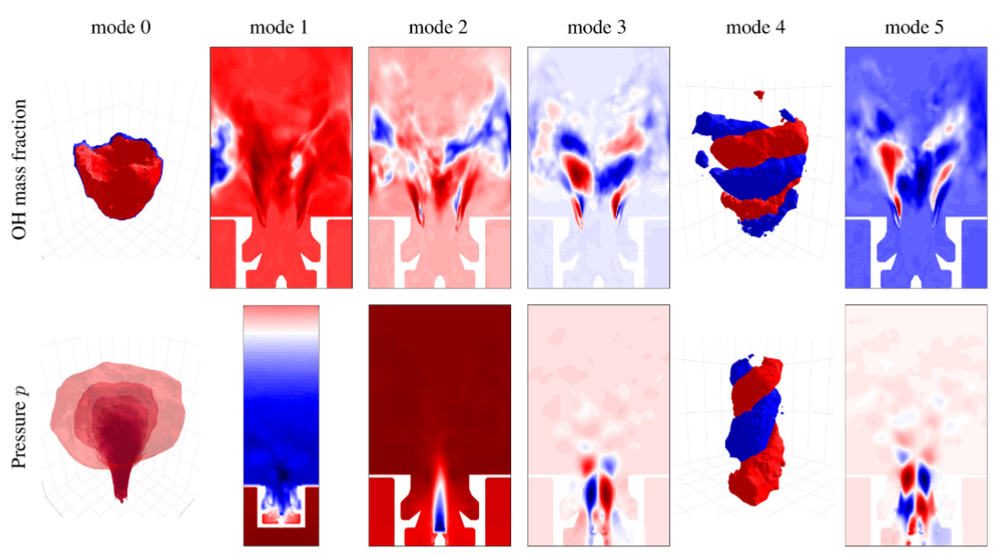
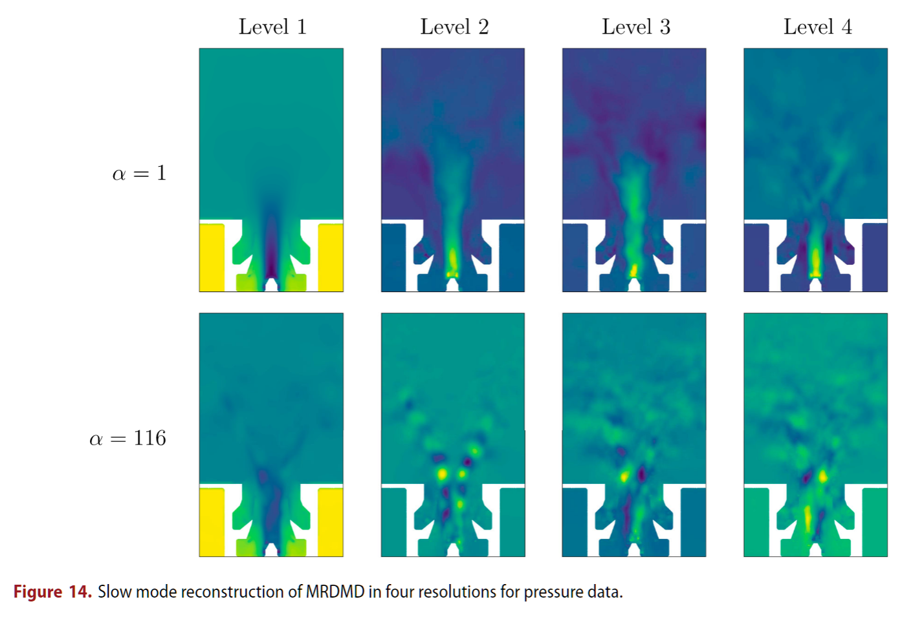

<h1 align="left">
    <div>
    PARAMOUNT: Parallel Modal Analysis of Large Datasets
</h1>

<p align="left">
PARAMOUNT is a lightweight Python toolkit for computing Proper Orthogonal Decomposition (POD) and Dynamic Mode Decomposition (DMD) on large numerical and experimental datasets. It leverages the power of parallel processing to analyze massive amounts of data efficiently.
</p>

# Overview

- **Distributed Processing:** Ideal for multi-core parallel processing of large data.
- **Methodology:** A brief video introduction into the theory is presented [here](https://www.youtube.com/watch?v=uz0q_TKrC84).
- **Proper Orthogonal Decomposition (POD):**

  - Perform distributed computation of POD to extract dominant spatial patterns.
  - Accompanying research paper:
  <p align="center"></p>
  > Alireza Ghasemi, et al. "Combustion Dynamics Analysis of a Pressurized Airblast Swirl Burner using Proper Orthogonal Decomposition." _International Journal of Spray and Combustion Dynamics_, 2023. [DOI:10.1177/17568277231207252](https://journals.sagepub.com/doi/10.1177/17568277231207252)
  >
- **Dynamic Mode Decomposition (DMD):**

  - Compute DMD modes, eigenvalues, and generate future state predictions.
  - Multi-resolution DMD (MRDMD) to analyze data across various temporal scales.
  - Accompanying research paper:
  <p align="center"></p>
  > Alireza Ghasemi, Jim B.W. Kok. "Exploring Liquid Fuel Combustion Dynamics in a Swirl Burner using Dynamic Mode Decomposition." _Engineering Applications of Computational Fluid Mechanics_, 2025. [DOI:10.1080/19942060.2025.2557009](https://www.tandfonline.com/doi/full/10.1080/19942060.2025.2557009)
  >
- **Visualization:** Easily visualize POD/DMD modes and coefficients.

# Using PARAMOUNT

1. **Installation:** Install the necessary dependencies:

   ```bash
   pip install -r requirements.txt
   ```

   ## Minimal usage example
2. **Data Preparation:**

   - Data processing functionality of PARAMOUNT is particularly suited for CSV datasets but can be adapted for other data formats.
   - Specify the variables of interest and convert the data into Parquet datasets for optimized performance and storage.
   - Refer to `csv_example` for a practical guide on using this feature.

   ```python
   # Convert your data into parquet format
   pod = POD()
   pod.csv_to_parquet(...)
   ```
3. **Analysis (POD/DMD/MRDMD):**

   - For POD: Utilize the `POD` class to compute the Singular Value Decomposition (SVD) from the prepared Parquet datasets. Results (U, S, V) will be stored. See `svd_example` for detailed usage.

   ```python
   # POD analysis
   pod.svd_save_usv(...)
   ```

- For DMD: Use the `DMD` class, which builds upon the `POD` infrastructure, to perform Dynamic Mode Decomposition, compute eigenvalues, and analyze system dynamics. Refer to `dmd_example` for implementation details.

  ```python
  # DMD analysis
  dmd = DMD()
  dmd.save_Atilde(...)
  dmd.save_modes(...)
  dmd.save_prediction(...)
  ```
- For Multi-Resolution DMD (MRDMD): Leverage the `MRDMD` functionality to analyze data across multiple DMD scales. See `mrdmd_example` for a step-by-step guide.

  ```python
  # MRDMD analysis
  dmd.multires(...)
  dmd.multires_predict(...)
  ```

4. **Visualization:**
   - PARAMOUNT provides several visualization tools based on Matplotlib. Refer to the example files for guidance on how to use them.
   - 3D data can be interactively visualized with Plotly. See `viz_example` for instructions on how to utilize this feature.

# Proposed Project Folder Structure
This is a sample project structure for using the PARAMOUNT library to perform POD and DMD analysis.

```
Project
├── myproject.py
├── .data
│   ├── variable_1
│   │   └── .parquet
│   ├── variable_2
│   │   └── .parquet
│   ├── x.pkl
│   └── y.pkl
├── .usv
│   ├── variable_1
│   │   ├── s.pkl
│   │   ├── u/.parquet
│   │   └── v/.parquet
│   ├── variable_2
│   │   ├── s.pkl
│   │   ├── u/.parquet
│   │   └── v/.parquet
│   ├── x.pkl
│   └── y.pkl
├── .dmd
│   ├── variable_1
│   │   ├── Atilde.pkl
│   │   ├── b.pkl
│   │   ├── lambda.pkl
│   │   ├── modes_imag/.parquet
│   │   ├── modes_real/.parquet
│   │   └── prediction/.parquet
│   ├── variable_2
│   │   ├── Atilde.pkl
│   │   ├── b.pkl
│   │   ├── lambda.pkl
│   │   ├── modes_imag/.parquet
│   │   ├── modes_real/.parquet
│   │   └── prediction/.parquet
├── .mrdmd
│   ├── variable_1/levels
│   │   ├── level_0/.parquet
│   │   ├── level_1/.parquet
│   │   └── ...
│   └── variable_2/levels
│       ├── level_0/.parquet
│       ├── level_1/.parquet
│       └── ...
├── .viz
│   ├── variable_1/results.png
│   └── variable_2/results.png
└── src
   ├── PARAMOUNT_BASE.py
   ├── PARAMOUNT_POD.py
   ├── PARAMOUNT_DMD.py
   └── utils.py
```

# Notes and Acknowledgements
If you use PARAMOUNT in published work, please cite the relevant accompanying paper.
This toolkit is developed by [Alireza Ghasemi](https://www.linkedin.com/in/alirezaaghasemi/) at University of Twente under the [MAGISTER](https://www.magister-itn.eu/) project.
